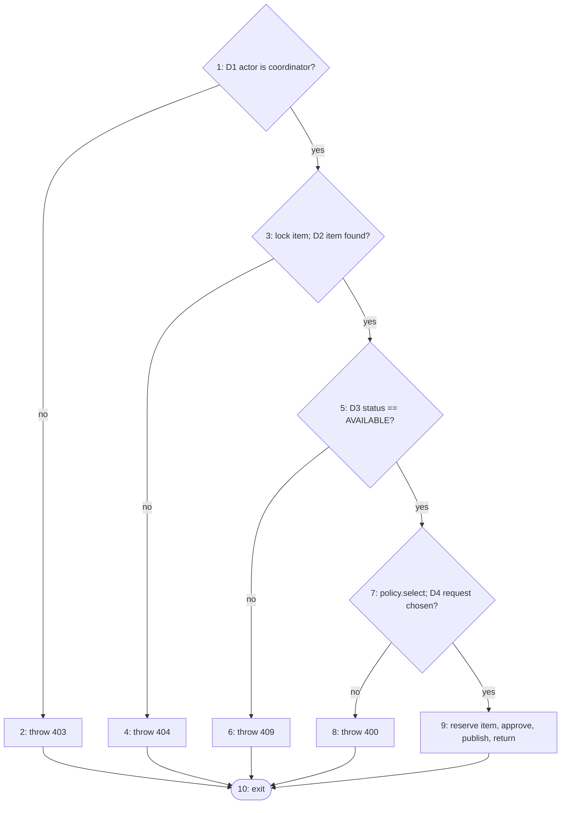

# Testing evidence

Raw outputs are in [`docs/test-evidence/`](test-evidence/). Everything in the "Result" columns below
was actually run on 2026-10-05 on the development laptop (Windows 11, Temurin JDK 17.0.20.1,
Flutter 3.47.6). What was **not** run is listed in section 7.

## 1. Summary

| Level | Where | Tool | Tests | Result |
|---|---|---|---|---|
| Unit | `backend/src/test/.../unit` | JUnit 5 | 28 | 28 passed |
| White-box / basis path | `backend/src/test/.../whitebox` | JUnit 5 + Mockito | 5 | 5 passed |
| Integration | `backend/src/test/.../integration` | Spring Boot Test + H2 | 17 | 17 passed |
| Black-box (HTTP API) | `backend/src/test/.../blackbox` | MockMvc | 33 | 33 passed |
| **Backend total** | | | **83** | **83 passed, 0 failed** |
| Flutter unit + widget | `mobile/test` | flutter_test | 12 | 12 passed |
| System smoke test (real server, real HTTP, file database) | `tools/smoke-test.ps1` | PowerShell | 1 scenario | passed |

Backend coverage measured by JaCoCo: **branch 78.4 % (116/148), line 89.9 % (473/526)**.
`RequestService` (the core service): branch 34/46, line 85/99.

How to repeat:

```powershell
. .\tools\env.ps1
cd backend;  .\gradlew.bat test          # report: backend\build\reports\tests\test\index.html
                                         # coverage: backend\build\reports\jacoco\test\html\index.html
cd ..\mobile; flutter test
```

## 2. Unit tests

| Class | What is checked |
|---|---|
| `AllocationPolicyTest` (5) | Strategy: FCFS picks the oldest request; coordinator choice picks the chosen one; both return nothing when no request qualifies. |
| `WorkflowTest` (19) | Factory Method creates the right workflow; loan period rule; due date = handover date + loan days; status transitions for loan and donation; a donation cannot be returned; overdue rule. |
| `ObserverAndAdapterTest` (4) | Observer: every subscriber receives an event, an unsubscribed one does not. Adapter: `send(user, message)` becomes `deliver(address, subject, body)`. |

## 3. Integration tests (`WorkflowIntegrationTest`)

Services + JPA + a real in-memory H2 database + the real observers. Nothing is mocked.

| Test | Verifies |
|---|---|
| `approval_reservesItem_notifiesStudent_andWritesAuditLog` | One approval updates the request, the item, creates a notification and an audit-log row. |
| `studentListing_needsCoordinatorReview_beforeItIsVisible` | A student's offer is hidden and cannot be requested until a coordinator approves it. |
| `loan_fullLifecycle_requestToReturn` | Request → approve → wrong code refused → handover (due date, code cleared) → return → dashboard +1. |
| `donation_fullLifecycle_andOtherPendingRequestsAreClosed` | FCFS approval, handover → `DONATED`; the other waiting request is closed; return refused. |
| `cancellingAnApprovedRequest_releasesTheReservation` | Item goes back to `AVAILABLE`. |
| `secondApprovalForTheSameItem_isRefused` | Sequential double allocation → HTTP 409 rule. |
| `failureInAnObserver_rollsBackTheWholeApproval` | **Transaction rollback**: a failing notification handler leaves request `PENDING`, item `AVAILABLE`, no pickup code, no notification. |
| `concurrentApprovals_produceExactlyOneAllocation` (×10) | **Acceptance criterion**: two threads approve two requests for the same item at the same moment → exactly one succeeds, in all 10 repetitions. |

### How double allocation is prevented

1. `RequestService.allocate()` is one database transaction (`@Transactional`).
2. The item row is read with `SELECT … FOR UPDATE` (`ItemRepository.findByIdForUpdate`), so a
   second approval for the same item waits until the first one commits.
3. After waiting, the second approval reads status `RESERVED` and is refused with HTTP 409.
4. Safety net: `ResourceItem` has a `@Version` column (optimistic lock).

## 4. Black-box tests (`ApiBlackBoxTest`)

Only the HTTP API is used, as the mobile app uses it. The tester needs no knowledge of the code.

### 4.1 Equivalence classes and boundary values

| Input | Valid class | Invalid classes | Boundary values tested → expected status |
|---|---|---|---|
| Loan period (days) | 1 … 30 | < 1, > 30, missing | 0 → 400, **1 → 201**, **30 → 201**, 31 → 400, −5 → 400, missing → 400 |
| Password length | ≥ 6 | < 6, missing | 5 chars → 400, **6 chars → 201**, missing → 400 |
| E-mail | well-formed, new | malformed, missing, already used | `not-an-email` → 400, missing → 400, duplicate → 409 |
| Item title | non-blank | missing, blank | missing → 400, `" "` → 400 |
| Item category / mode | one of the enum values | unknown, missing | `LAPTOP` → 400, missing → 400 |
| Item id in a request | existing item | unknown, missing | 99999999 → 404, missing → 400 |
| Loan period on a donation | (ignored) | – | donation without loan period → 201 |

### 4.2 Permission matrix

| Action | No token | Student | Other student | Coordinator |
|---|---|---|---|---|
| `GET /api/health` | 200 | 200 | – | 200 |
| `GET /api/items` | 401 | 200 | – | 200 |
| Create a request | 401 | 201 | – | 403 |
| Approve / reject / allocate-fcfs | 401 | 403 | 403 | 200 |
| Hand over / record return | 401 | 403 | – | 200 |
| Review a listing | 401 | 403 | – | 200 |
| List all requests | 401 | 403 | – | 200 |
| Read one request | 401 | 200 (own) | 403 | 200 |
| Cancel a request | 401 | 200 (own) | 403 | 200 |
| See the pickup code | – | yes (own) | – | no |

Other black-box cases: invalid token → 401, wrong password → 401, logout invalidates the token,
self-registration always creates a student, duplicate active request → 409, search by text /
category / mode, and one complete loan scenario including "pickup code is single-use".

## 5. White-box: basis-path testing of `RequestService.allocate()`

Source (decisions numbered):

```java
public ResourceRequest allocate(User actor, Long itemId, AllocationPolicy policy, Long chosenRequestId) {
    if (!actor.isCoordinator())                       // D1
        throw forbidden;                              // node 2
    item = items.findByIdForUpdate(itemId);
    if (item == null)                                 // D2
        throw notFound;                               // node 4
    if (item.getStatus() != AVAILABLE)                // D3
        throw conflict;                               // node 6
    pending = requests.find…(item, PENDING);
    chosen  = policy.select(pending, chosenRequestId);
    if (chosen == null)                               // D4
        throw badRequest;                             // node 8
    item.setStatus(RESERVED); chosen.setStatus(APPROVED); …publish event…
    return chosen;                                    // node 9
}
```

Control-flow graph:



Cyclomatic complexity, three ways:

* Predicate nodes + 1 = 4 + 1 = **5**
* Edges − Nodes + 2 = 13 − 10 + 2 = **5**
* Regions of the graph = **5**

Basis set (5 independent paths) and the test for each, in `AllocateBasisPathTest`:

| # | Path | Input | Expected | Test | Result |
|---|---|---|---|---|---|
| 1 | 1-2-10 | actor = student | 403, database never touched | `path1_studentIsRefused` | pass |
| 2 | 1-3-4-10 | coordinator, unknown item | 404 | `path2_unknownItem` | pass |
| 3 | 1-3-5-6-10 | item status `RESERVED` | 409, item unchanged | `path3_itemAlreadyAllocated` | pass |
| 4 | 1-3-5-7-8-10 | item available, no pending request | 400, item still `AVAILABLE` | `path4_noPendingRequest` | pass |
| 5 | 1-3-5-7-9-10 | item available, one pending request | request `APPROVED`, item `RESERVED`, 6-digit code, 1 event | `path5_successfulAllocation` | pass |

## 6. System smoke test and defect found

`tools/smoke-test.ps1` was run against the packaged jar (`java -jar`) with the file database:
login as student and coordinator → search → request → student approval refused (403) →
coordinator approval → pickup code visible to the student only → handover → return →
3 notifications → dashboard. Output: `docs/test-evidence/smoke-test-output.txt`.

**Defect log**

| # | Found by | Defect | Severity | Fix | Verified by |
|---|---|---|---|---|---|
| 1 | Smoke test, second run | After the server process was killed right after a "return", the restart showed the item still `ON_LOAN`. Cause: H2 writes commits to disk with a delay of up to 0.5 s. | High (data loss) | `WRITE_DELAY=0` in the JDBC URL (`application.properties`) | Smoke test → kill server immediately → restart → request `RETURNED`, item `AVAILABLE`, dashboard unchanged. |

## 7. Not tested — do not claim these as verified

* **The app on a real Android phone.** The APK was built, but it was not installed or run on a
  device in this work session. Phone ↔ laptop Wi-Fi connection is therefore also untested.
* The **MySQL profile** (`application-mysql.properties`) was written but never started; no MySQL
  server is installed on the development laptop. All tests ran on H2.
* Flutter screens other than the login screen have no automated widget tests. They pass static
  analysis (`flutter analyze`: no issues) but were not exercised by hand.
* No test with real users, no usability or performance/load testing, no backup-restore drill
  beyond the restart check in section 6.
* The e-mail channel is a console stub; no real e-mail was sent.
